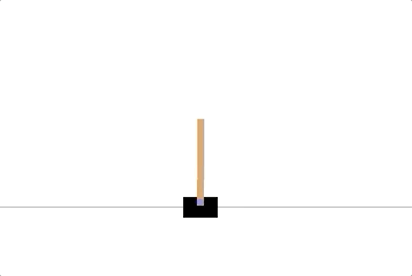

# Bonsai Gym

Bonsai Gym is an open-source interface library, which gives us access to OpenAI Gym standardised set of environments while using Microsoft Bonsai platform.

## Basics

There are two basic concepts in reinforcement learning: the environment (namely, the outside world) and the agent (namely, the algorithm you are writing). The agent sends actions to the environment, and the environment replies with observations and rewards (that is, a score).

OpenAI Gym is a toolkit for developing and comparing reinforcement learning algorithms. The gym open-source library, gives us access to a standardised set of environments. Environments come as is with no predefined agent.

Link to Open AI environments: https://github.com/openai

Bonsai is the machine teaching service in the Autonomous Systems suite from Microsoft. It builds on innovations in reinforcement learning to simplify AI development.
We use Bonsai to create agents (brains) that control and optimise complex systems. No neural net design required.

Full documentation for Bonsai's Platform can be found at https://docs.bons.ai.

## Set-Up

Bonsai need two environment variables set to be able to attach to the platform.

The first is **SIM_ACCESS_KEY**. You can create one from the Account Settings page.
The second is **SIM_WORKSPACE**. You can find this in the URL after ***/workspaces/*** once you are logged in to the platform.


You will need to install support libraries prior to running locally.
Our environment depend on **microsoft_bonsai_api** package and on **gym_connectors** from this codebase.

```
cd connectors
pip3 install .
pip3 install microsoft_bonsai_api
```

## Environments

We have developed few working examples and we aim to expand this list continuously by adding new environments from different physics engines.
As with every problem, there are more than just one way to solve or achieve satisfactory results.
We are open to suggestions and we encourage code contribution.

Inside on each environment folder we have created an agent that can run locally to communicate with the exported Bonsai brain (running on Docker) and is rendering the simulation using Open AI environment.

### Classic Controls

A collection of control theory problems from the classic RL literature.

#### 1. Inverted Pendulum

The inverted pendulum swing-up problem is a classic problem in the control literature. In this version of the problem, the pendulum starts in a random position, and the goal is to swing it up so it stays upright.

We have trained the agent using a reward function, although a goal statement produced equally good results.

Reward function:
```
function GetReward(State: SimState, Action: SimAction) {
    var u = Action.command
    var th = Math.ArcCos(State.cos_theta)
    var rew = ((((th + Math.Pi) % (2 * Math.Pi)) - Math.Pi) ** 2) + 0.1 * (State.angular_velocity ** 2) + 0.001 * (u ** 2)

    return -rew
}
```
Alternative Goal statement:
```
goal (State: SimState) {
    drive `cos upwards`:
        State.cos_theta in Goal.Range(0.707, 1.0)
}
```

- Bonsai training output:


- Exported agent (brain) performance:


#### 2. Mountain Car

A car is on a one-dimensional track, positioned between two "mountains". The goal is to drive up the mountain on the right; however, the car's engine is not strong enough to scale the mountain in a single pass. Therefore, the only way to succeed is to drive back and forth to build up momentum.

The environment appeared first in Andrew Moore's PhD Thesis (1990).

We have trained the agent using two  goal statements.

```
goal (State: SimState) {
    reach `car position`:
        State.position in Goal.RangeAbove(0.5)  
    maximize `speed`:
        Math.Abs(State.speed) in Goal.Range(0, 0.07)      
}
```

- Bonsai training output:


- Exported agent (brain) performance:


#### 3. Cart Pole

A pole is attached by an un-actuated joint to a cart, which moves along
a frictionless track. The pendulum starts upright, and the goal is to
prevent it from falling over by increasing and reducing the cart's
velocity.

This environment corresponds to the version of the cart-pole problem
described by Barto, Sutton, and Anderson

We have trained the agent using two  goal statements.

```
goal (State: SimState) {
    avoid `Fall Over`:
        Math.Abs(State.pole_angle) in Goal.RangeAbove(0.15) # 0.15 is 0.05 less than the maximum angle of pole in radians before it has fallen
    avoid `Out Of Range`:
        Math.Abs(State.cart_position) in Goal.RangeAbove(1.4) # 1.4 reduces the space the cartpole is allowed to move while balancing
}
```

- Bonsai training output:


- Exported agent (brain) performance:



### PyBullet

Bullet is a physics engine which simulates collision detection, soft and rigid body dynamics.

#### 1. Reacher
**Coming Soon!**


